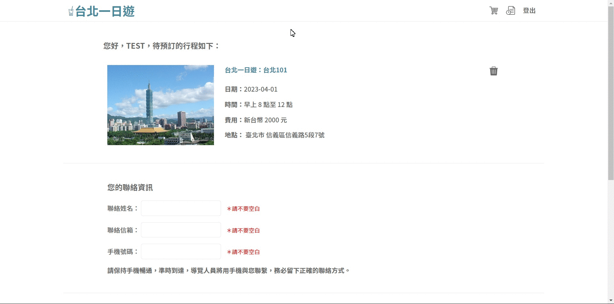
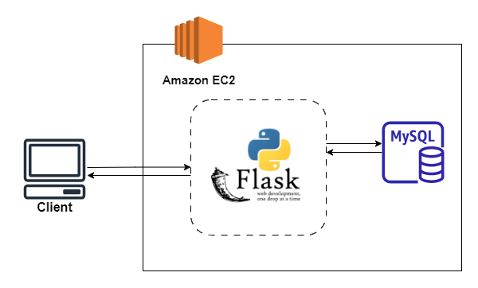
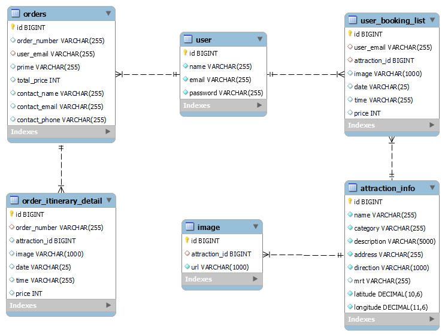

# Taipei Day Trip Website

✨Taipei Day Trip is a tourism e-commerce website that allows users to search Taipei attractions and book itineraries.

🔗 Website URL: ~~http://3.211.21.229:3000/~~
( ⚠️ This project is currently not maintained, and the URL is not available at this time )

👤 Test Account and Password:
| Account | Password |
| --- | --- |
| test@test.com | 12345678 |

💳 Payment Test: 
| Card Number | Expiration Date | CVV |
| --- | --- | --- |
| 4242 4242 4242 4242 | 01/25 | 123 |

## Table of Contents

- [Demo](#demo)
- [Main Features](#main-features)
- [Backend Technique](#backend-technique)
- [Architecture](#architecture)
- [Database Schema](#database-schema)
- [Frontend Technique](#frontend-technique)
- [API Documentation](#api-documentation)
- [Contact](#contact)

## Demo

 

## Main Features
- Member system with `JWT(JSON Web Token)` authentication.
- Display attractions on homepage.
- Search keywords for exploring ideal destination.
- Support RWD (Responsive Web Design).
- Custom image slideshow.
- Loading effect.
- Itinerary booking.
- Payment system with `TapPay`.
- Order history.

## Backend Technique

### Language / Web Framework
- Python / Flask

### Database
- MySQL

### Cloud Services (AWS)
- EC2

### Authentication
- Bcrypt
- JSON Web Token (JWT)

### Architectural pattern
- MVC pattern

### Version Control
- Git/ GitHub

## Architecture

## Database Schema

## Frontend Technique
- JavaScript
- HTML
- CSS
- AJAX

## API Documentation
<a href="https://app.swaggerhub.com/apis-docs/padax/taipei-day-trip/1.1.0">API Documentation</a>

## Contact
☁️ 簡劭芸 Shaoyun Jian 

✉ Email: shaoyunjianfw@gmail.com
